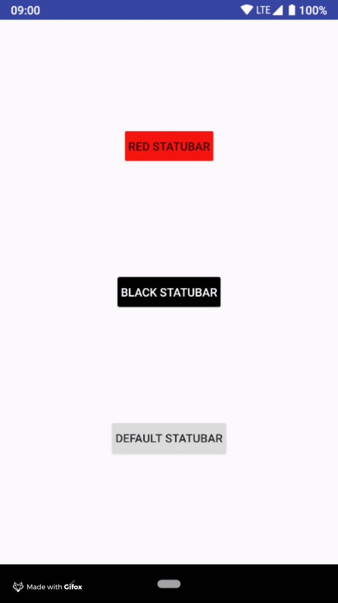
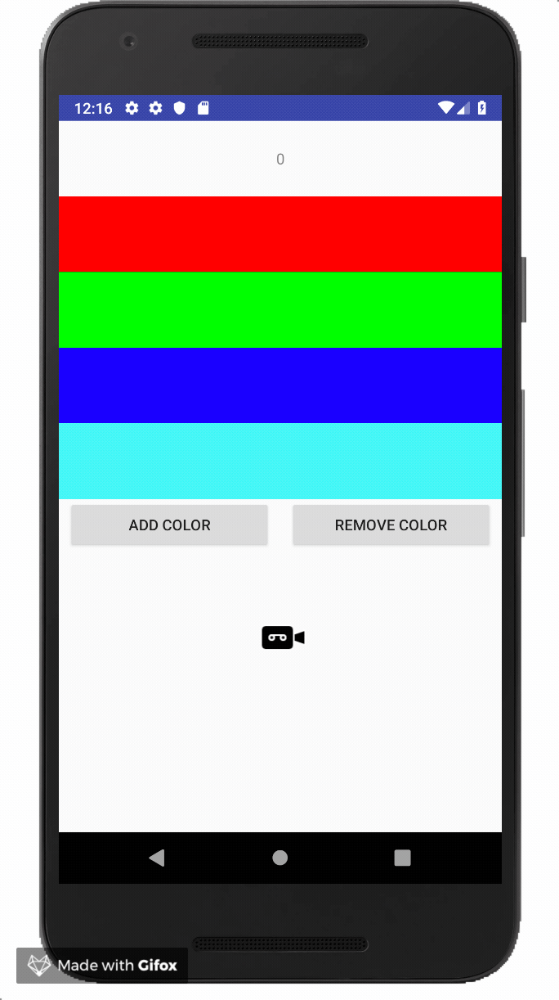

# Nomtek Utills  
Collection of tools for android development.  
Detailed instructions are available in **How to use** sections.  
  
### How to install  
##### 1. Add jitpack repository to your gradle file 
<<<<<<< HEAD
```gradle  
allprojects {  
	repositories { ... 
		maven { url 'https://jitpack.io' } 
	} 
}
 ```  
  
##### 2. Add dependency to your gradle file  
  
###### ToolbarController  [How to use](https://github.com/nomtek/NomtekUtills/blob/master/toolbarcontroller/README.md)  
  
  
  
```gradle  
implementation 'com.github.nomtek.NomtekUtills:toolbarcontroller:1.0.2'  
```   
###### StatusbarController  [How to use](https://github.com/nomtek/NomtekUtills/blob/master/statusbarcontroller/README.md) 
  
  
  
```gradle  
implementation 'com.github.nomtek.NomtekUtills:statusbarcontroller:1.0.2'  
```

###### RecyclerBucketList  [How to use](https://github.com/nomtek/NomtekUtills/blob/master/recyclerbucketlist/README.md)



```gradle
implementation 'com.github.nomtek.NomtekUtills:recyclerbucketlist:1.0.2'
```


