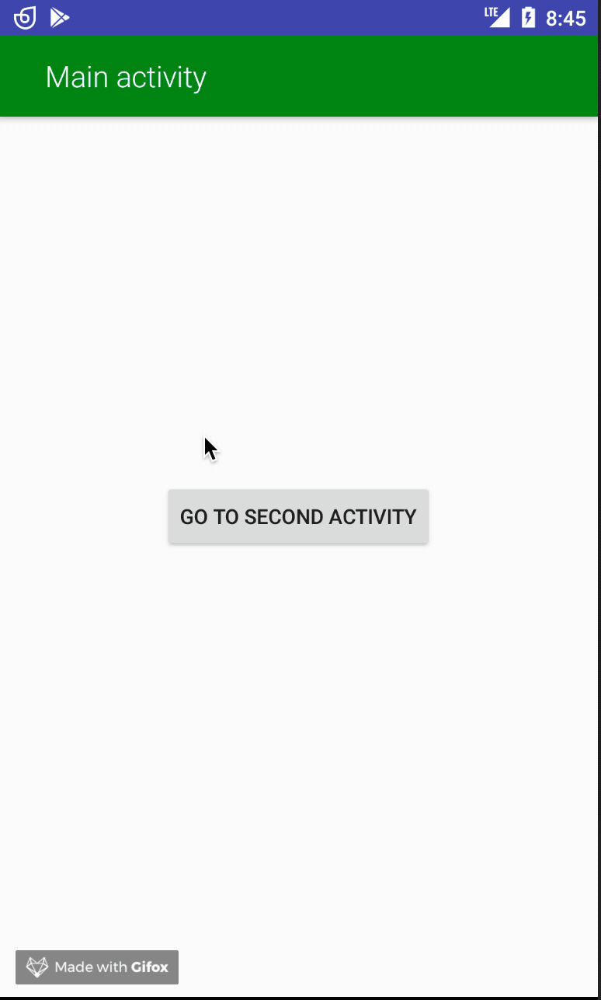

# ToolbarController (min sdk version - 16 )
Create and customise your own toolbar!



### How to install
##### 1. Add jitpack repository to your gradle file 
```gradle
allprojects {
		repositories {
			...
			maven { url 'https://jitpack.io' }
		}
	}
```

##### 2. Add dependency to your gradle file

###### ToolbarController [How to use](https://github.com/nomtek/NomtekUtills/blob/master/toolbarcontroller/README.md)
```gradle
implementation 'com.github.nomtek.NomtekUtills:toolbarcontroller:1.0.0'
``` 
