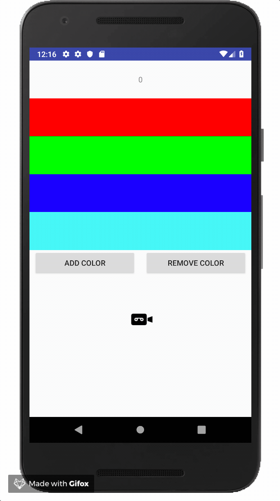

[](https://jitpack.io/#nomtek/NomtekUtills)
# Recycler bucket list (min sdk version - 16 )
Managing complex recylerView collections was never easier!
This library simplifies managing complex recyclerview collections. This libreary is useful if you
have multiple types of items in one recyclerview.
You put your recyclerview items into buckets that you define.



### How to use ( full example in the "app" folder )
##### 1. Create list item bucket for you recyclerView. It should extend from ListItemBucket
```kotlin
class HomeListItemBucket : ListItemBucket<HomeListItem>() {

    init {
        putItems(COLORS_ITEM_TOP_BUCKET, Collections.emptyList())
        putItems(COUNTER_ITEM_BUCKET, CounterHomeListItem(0))
        val colors: IntArray = intArrayOf(Color.RED, Color.GREEN, Color.BLUE, Color.CYAN)
        putItems(COLORS_ITEM_BUCKET, colors.map { ColorHomeListItem(it) })
    }

    ...

    //this companion object defines order of the buckets
    companion object {

        private const val COLORS_ITEM_TOP_SECTION = 0

        private const val COUNTER_ITEM_SECTION = 1

        private const val COLORS_ITEM_SECTION = 2

        private const val FOOTER_ITEM_SECTION = 3
    }
}

```

##### 2. Get recyclerView items from created bucket and pass them to adapter
```kotlin
val bucket = HomeListItemBucket()
adapter.items = bucket.items.toMutableList()
adapter.notifyDataSetChanged()
```


