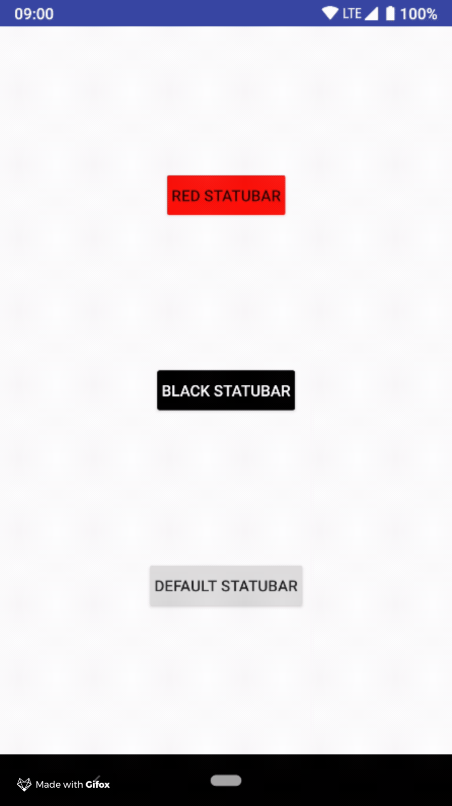

[](https://jitpack.io/#nomtek/NomtekUtills)
[](https://opensource.org/licenses/MIT)


# StatusBarController (min sdk version - 21 )
Customize toolbar with one line of the code!



### How to use ( full example in the "app" folder )

##### 1.  Set statusbar color with resouce color
```kotlin
override fun onCreate(savedInstanceState: Bundle?) {
    super.onCreate(savedInstanceState)
    setContentView(R.layout.activity_main)
    StatusBarController(this, backgroundColorRes = R.color.red)
}
```
##### 2.  Set statusbar color with hex color
```kotlin
override fun onCreate(savedInstanceState: Bundle?) {
    super.onCreate(savedInstanceState)
    setContentView(R.layout.activity_main)
    StatusBarController(this, backgroundColorHex = Color.WHITE)
}
```

##### 3.  Change statusbar tint color
```kotlin
override fun onCreate(savedInstanceState: Bundle?) {
    super.onCreate(savedInstanceState)
    setContentView(R.layout.activity_main)
    StatusBarController(this, backgroundColorHex = Color.WHITE, isDarkTint = true)
}
```
