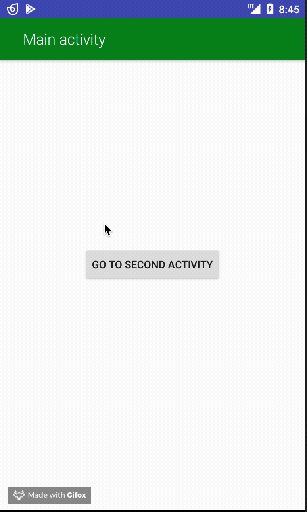

[](https://jitpack.io/#nomtek/NomtekUtills)
# ToolbarController (min sdk version - 16 )
Create and customise your own toolbar!



### How to use ( full example in the "app" folder )
##### 1. Add toolbar to your activity  - remember to change Activity theme to NoActionBar!
```xml
  <android.support.v7.widget.Toolbar
        android:id="@+id/toolbar" 
        android:layout_width="match_parent"
        android:layout_height="?attr/actionBarSize" />
```

##### 2. Create the content layout for your toolbar
```xml
<android.support.constraint.ConstraintLayout xmlns:android="http://schemas.android.com/apk/res/android"
    android:layout_width="match_parent"
    android:layout_height="match_parent"
    xmlns:app="http://schemas.android.com/apk/res-auto">

    <ImageView
        android:id="@+id/backActionImageView"
        android:layout_width="wrap_content"
        android:layout_height="wrap_content"
        style="@style/ToolbarIconImageViewLight"
        app:layout_constraintBottom_toBottomOf="parent"
        app:layout_constraintStart_toStartOf="parent"
        app:layout_constraintTop_toTopOf="parent"
        app:srcCompat="@drawable/ic_arrow_back_black"/>

    <TextView
        android:id="@+id/titleTextView"
        android:layout_width="wrap_content"
        android:layout_height="wrap_content"
        android:gravity="center"
        style="@style/ToolbarTitleBoldWhiteWithBackAction"
        android:text="@string/second_activity_toolbar_title"
        app:layout_constraintBottom_toBottomOf="parent"
        app:layout_constraintStart_toStartOf="parent"
        app:layout_constraintTop_toTopOf="parent"/>


</android.support.constraint.ConstraintLayout>
```

##### 2. Create decorators for each view item you want to customize/set (the ToolbarDecorator interface is provided)
```kotlin
class ToolbarTitleDecorator(private val title: String) : ToolbarDecorator {

    override fun build(toolbar: Toolbar) {
        val titleTextView : TextView = toolbar.findViewById(R.id.titleTextView)
        titleTextView.text = title
    }
}
```

##### 3. Instantiate ToolbarController in your Activity
```kotlin
    private val toolbarController: ToolbarController = ToolbarController()
```

##### 4. Use it (in onCreate method) to set the decorators and build the toolbar with your layout.
```kotlin
toolbarController
                .addDecorator(ToolbarBackgroundColorDecorator(colorRes= R.color.green))
                .addDecorator(ToolbarTitleDecorator(resources.getString(R.string.main_activity_toolbar_title)))
                .build(toolbar, R.layout.main_activity_toolbar)
```


